# Manuel technique — Plateforme INPTIC

Ce document décrit le fonctionnement du code actuellement présent dans le
dépôt, les profils applicatifs, les appels API et les services nécessaires. Il
complète le [cahier des charges](./cahier-des-charge.md) et le [guide
d'utilisation](./tkt.md). Les schémas Mermaid peuvent être visualisés dans un
éditeur ou une forge qui prend en charge Mermaid.

> Les fichiers décrivent une cible d'exploitation Node.js sur LWS et le domaine
> public `https://inptic-ga.org`. La présence de cette configuration dans le
> projet ne prouve pas à elle seule l'état réel du DNS, du déploiement ou des
> services tiers. Vérifier les consoles d'exploitation avant toute intervention.

## 1. Fiche technique

| Élément | Implémentation |
| --- | --- |
| Domaine public prévu | `https://inptic-ga.org` |
| Hébergement applicatif décrit par le projet | Application Next.js en Node.js sur LWS |
| Serveur web applicatif | Next.js 16.3.4, App Router, rendu serveur et routes API |
| Langages | TypeScript/TSX pour le site; JavaScript pour quelques scripts Node; SQL pour PostgreSQL; TypeScript côté Strapi |
| Interface | React 19, Tailwind CSS 4, i18next; PWA installable dans les navigateurs compatibles |
| Runtime | Node.js `>=20` déclaré pour le site; `node:sqlite` utilisé par l'historique IA requiert Node.js 22.5 ou plus récent |
| Base métier et authentification | PostgreSQL, accès serveur via `pg` |
| Fichiers | Disque persistant côté serveur, configuré par `PRIVATE_STORAGE_DIR`; métadonnées et visibilité en PostgreSQL |
| CMS séparé | Strapi 5.55.1, API REST; base par défaut SQLite en développement, PostgreSQL/MySQL possibles |
| Courriel | Resend pour l'authentification et la newsletter |
| Paiement | SingPay pour Airtel Money et Moov Money, si le portefeuille et les identifiants sont configurés |
| IA | Google Gemini en principal; OpenAI/OpenRouter comme fournisseurs de repli configurables |
| Veille | Flux technologiques, Facebook Graph API et YouTube Data API selon disponibilité et configuration |
| Analytics | Vercel Analytics |

Les plages de versions et commandes exactes figurent dans
[`package.json`](./package.json), [`strapi/package.json`](./strapi/package.json)
et les fichiers lock. Les dépendances `node_modules/` ne constituent pas la
source de versionnement.

## 2. Vue d'ensemble du code

```text
app/
  page.tsx                  Accueil
  .../page.tsx              Pages publiques et espaces de gestion
  api/                      Routes HTTP Next.js
components/                  Navigation, formulaires et composants réutilisés
lib/                         Authentification, rôles, PostgreSQL, stockage, helpers
scripts/                     Schéma et migrations SQL, scripts d'exploitation
public/                      Images, icônes, polices et ressources statiques
strapi/                      CMS headless et son API d'administration
chatbot/                     Ancien template séparé conservé comme référence
```

- `app/` suit l'App Router Next.js : un `page.tsx` définit une page et
  `app/api/**/route.ts` (ou `.tsx`) définit un endpoint HTTP.
- Les composants React marqués `'use client'` gèrent l'interaction dans le
  navigateur. Les composants et routes serveur effectuent les accès secrets
  vers PostgreSQL, le disque et les fournisseurs externes.
- `lib/postgres.ts` fournit la connexion PostgreSQL; `lib/postgres-auth.ts`
  implémente la session; `lib/roles.ts` centralise la normalisation des rôles et
  l'autorisation par service.
- `lib/localStorage.ts` désigne un stockage de fichiers sur disque serveur (ce
  n'est pas le `localStorage` du navigateur). Les fichiers privés ne doivent
  être lus qu'après contrôle d'accès par une route.
- `lib/chatbot-db.ts` conserve les conversations, messages et documents de
  l'assistant dans SQLite via `node:sqlite`, dans `data/inptic-chatbot.sqlite`
  par défaut ou le chemin `INPTIC_CHATBOT_DB_PATH`.
- Le catalogue de formation peut encore lire les données éditoriales de
  Strapi; les ressources du catalogue administrées par l'interface utilisent
  les routes Next.js, PostgreSQL et le stockage serveur.

## 3. Rôles, services et autorisations

L'interface peut cacher les liens non accessibles, mais ce n'est pas la
protection. Les routes serveur relisent la session et vérifient le rôle et le
service attribué avant une opération protégée.

| Profil décrit | Rôle / service | Accès principal |
| --- | --- | --- |
| Visiteur | Sans session | Pages publiques, recherche, lecture, partage et inscription newsletter |
| Candidat / étudiant | `etudiant` | Compte, préinscription, dépôt, paiement et suivi individuel |
| Alumni | Compte authentifié avec propriété vérifiée de sa fiche | Lire l'annuaire et modifier uniquement son profil |
| Admin Scolarité | `admin` + service `scolarite`, ou rôle historique normalisé | Dossiers candidats, documents et préinscriptions autorisés |
| Admin Communication | `admin` + service `communication`, ou rôle historique normalisé | Annonces, actualités, veille et contenus de l'accueil |
| Admin Direction des études | `admin` + service `direction_etudes`, ou rôle historique normalisé | Concours, publications et catalogue de formations |
| Admin RH | `admin` + service `rh`, ou rôle RH historique autorisé | Profils du personnel, cartes QR, statistiques et audit |
| Superadmin | `superadmin` | Tous les espaces, comptes du personnel et opérations globales |

Les anciens rôles sont normalisés par `lib/roles.ts`; leur compatibilité ne
signifie pas qu'ils sont proposés dans l'interface de création actuelle. La
création des comptes du personnel se fait par un Superadmin dans `/admin` ou
par la commande serveur `npm run create-admin`. Un compte `admin` doit avoir
un seul service attribué. Le tableau `/directeur` est une interface de
Direction et, dans l'application actuelle, son accès général est réservé au
Superadmin; ce n'est pas un service supplémentaire attribuable au compte Admin.
L'annuaire Alumni est public et chaque compte vérifié peut créer puis modifier
uniquement sa propre fiche; aucune gestion globale Alumni par Superadmin n'est
exposée par la route API actuelle.

### 3.1 Cas d'utilisation — Visiteur

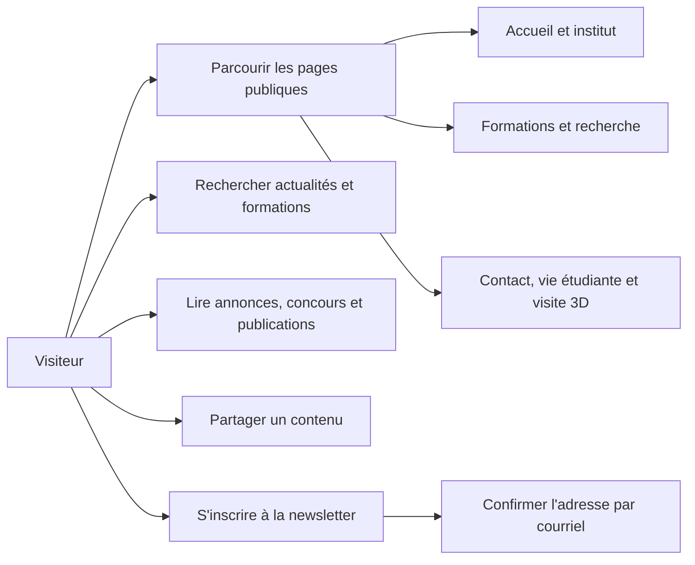
```mermaid
flowchart LR
    V[Visiteur] --> P[Parcourir les pages publiques]
    V --> R[Rechercher actualités et formations]
    V --> I[Lire annonces, concours et publications]
    V --> S[Partager un contenu]
    V --> N[S'inscrire à la newsletter]
    P --> H[Accueil et institut]
    P --> F[Formations et recherche]
    P --> C[Contact, vie étudiante et visite 3D]
    N --> E[Confirmer l'adresse par courriel]
```

### 3.2 Fonctionnement — Visiteur

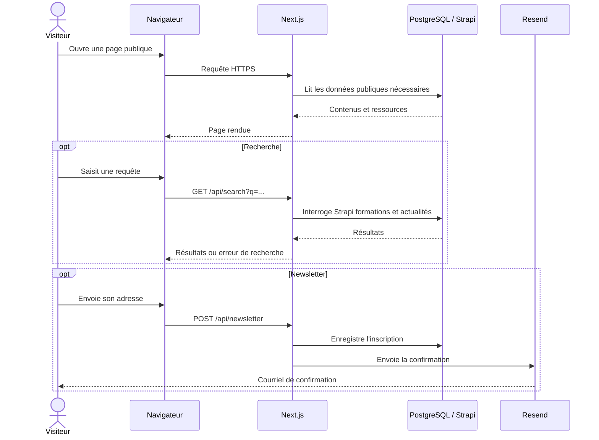
```mermaid
sequenceDiagram
    actor V as Visiteur
    participant B as Navigateur
    participant N as Next.js
    participant D as PostgreSQL / Strapi
    participant R as Resend
    V->>B: Ouvre une page publique
    B->>N: Requête HTTPS
    N->>D: Lit les données publiques nécessaires
    D-->>N: Contenus et ressources
    N-->>B: Page rendue
    opt Recherche
      V->>B: Saisit une requête
      B->>N: GET /api/search?q=...
      N->>D: Interroge Strapi formations et actualités
      D-->>N: Résultats
      N-->>B: Résultats ou erreur de recherche
    end
    opt Newsletter
      V->>B: Envoie son adresse
      B->>N: POST /api/newsletter
      N->>D: Enregistre l'inscription
      N->>R: Envoie la confirmation
      R-->>V: Courriel de confirmation
    end
```

## 4. Diagrammes par profil

### 4.1 Candidat / étudiant

#### Cas d'utilisation

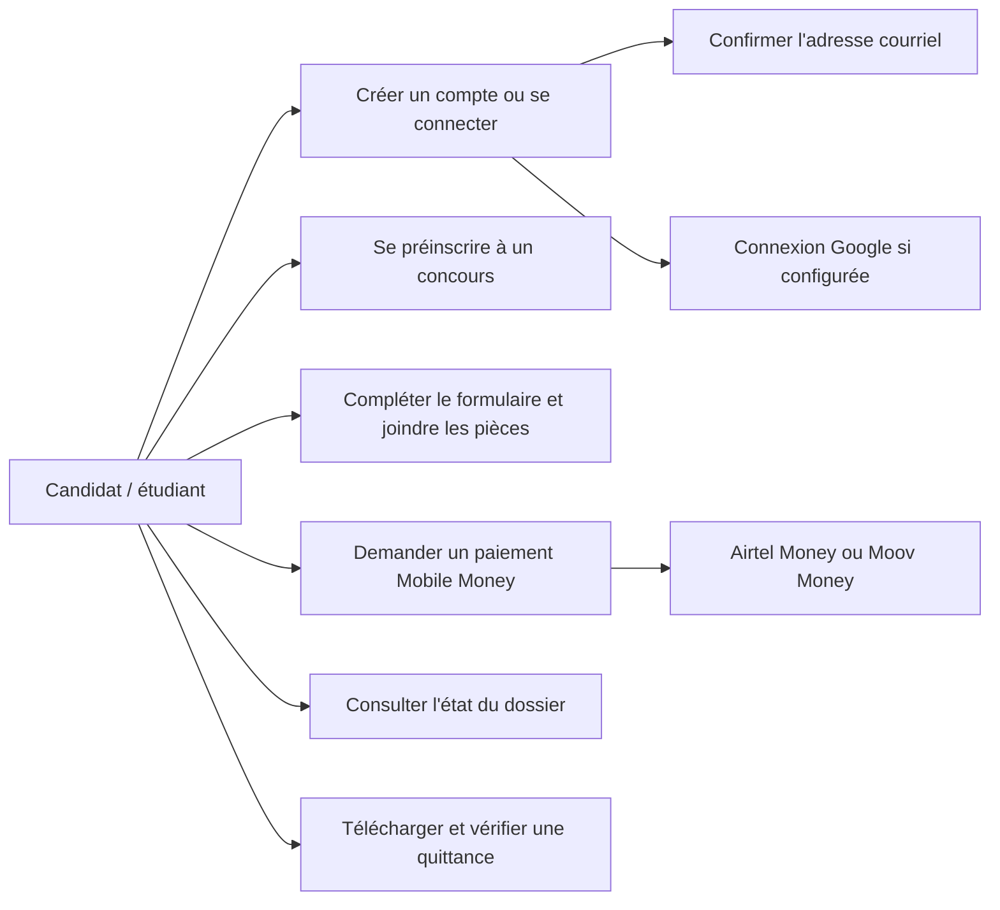
```mermaid
flowchart LR
    C[Candidat / étudiant] --> A[Créer un compte ou se connecter]
    C --> PR[Se préinscrire à un concours]
    C --> D[Compléter le formulaire et joindre les pièces]
    C --> PM[Demander un paiement Mobile Money]
    C --> S[Consulter l'état du dossier]
    C --> Q[Télécharger et vérifier une quittance]
    A --> M[Confirmer l'adresse courriel]
    A --> G[Connexion Google si configurée]
    PM --> O[Airtel Money ou Moov Money]
```

#### Fonctionnement

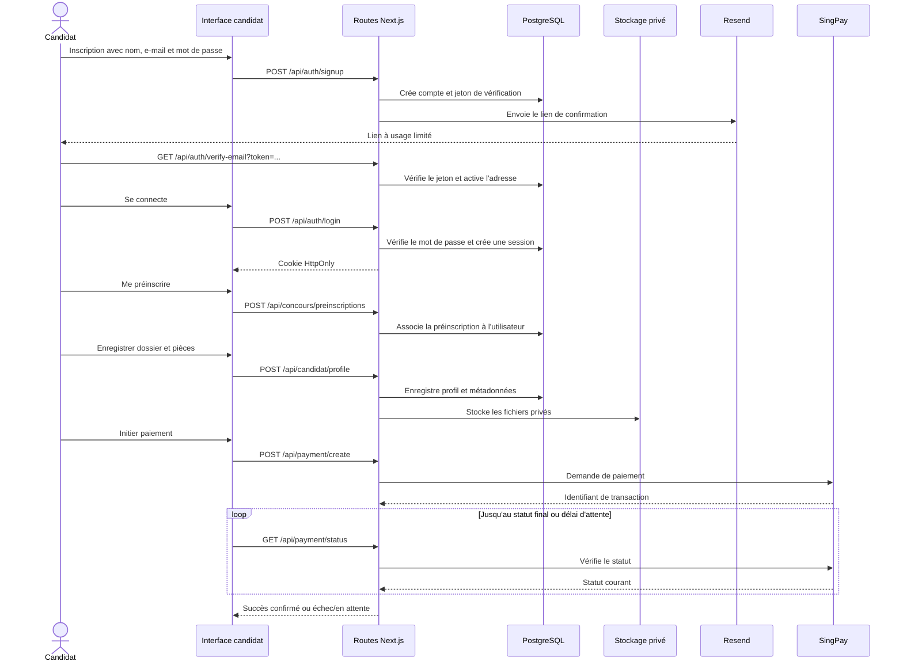
```mermaid
sequenceDiagram
    actor C as Candidat
    participant UI as Interface candidat
    participant API as Routes Next.js
    participant DB as PostgreSQL
    participant FS as Stockage privé
    participant Mail as Resend
    participant SP as SingPay
    C->>UI: Inscription avec nom, e-mail et mot de passe
    UI->>API: POST /api/auth/signup
    API->>DB: Crée compte et jeton de vérification
    API->>Mail: Envoie le lien de confirmation
    Mail-->>C: Lien à usage limité
    C->>API: GET /api/auth/verify-email?token=...
    API->>DB: Vérifie le jeton et active l'adresse
    C->>UI: Se connecte
    UI->>API: POST /api/auth/login
    API->>DB: Vérifie le mot de passe et crée une session
    API-->>UI: Cookie HttpOnly
    C->>UI: Me préinscrire
    UI->>API: POST /api/concours/preinscriptions
    API->>DB: Associe la préinscription à l'utilisateur
    C->>UI: Enregistrer dossier et pièces
    UI->>API: POST /api/candidat/profile
    API->>DB: Enregistre profil et métadonnées
    API->>FS: Stocke les fichiers privés
    C->>UI: Initier paiement
    UI->>API: POST /api/payment/create
    API->>SP: Demande de paiement
    SP-->>API: Identifiant de transaction
    loop Jusqu'au statut final ou délai d'attente
      UI->>API: GET /api/payment/status
      API->>SP: Vérifie le statut
      SP-->>API: Statut courant
    end
    API-->>UI: Succès confirmé ou échec/en attente
```

### 4.2 Alumni authentifié

#### Cas d'utilisation

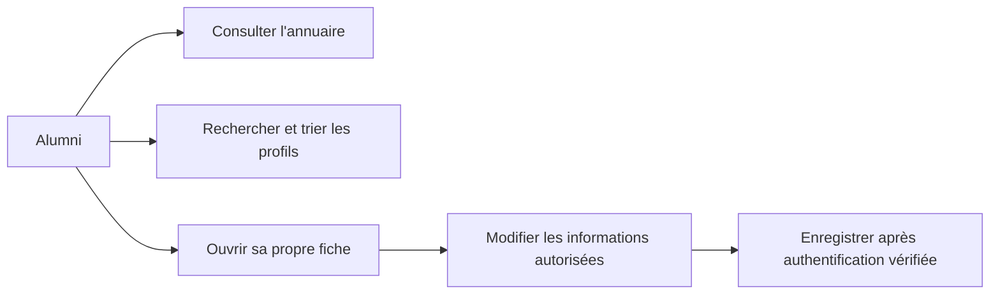
```mermaid
flowchart LR
    A[Alumni] --> L[Consulter l'annuaire]
    A --> F[Rechercher et trier les profils]
    A --> O[Ouvrir sa propre fiche]
    O --> E[Modifier les informations autorisées]
    E --> V[Enregistrer après authentification vérifiée]
```

#### Fonctionnement

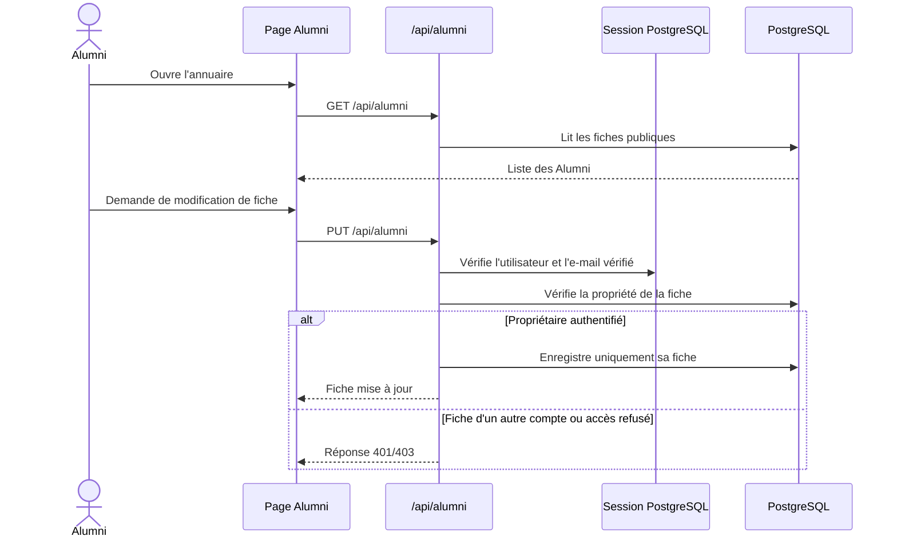
```mermaid
sequenceDiagram
    actor A as Alumni
    participant UI as Page Alumni
    participant API as /api/alumni
    participant Auth as Session PostgreSQL
    participant DB as PostgreSQL
    A->>UI: Ouvre l'annuaire
    UI->>API: GET /api/alumni
    API->>DB: Lit les fiches publiques
    DB-->>UI: Liste des Alumni
    A->>UI: Demande de modification de fiche
    UI->>API: PUT /api/alumni
    API->>Auth: Vérifie l'utilisateur et l'e-mail vérifié
    API->>DB: Vérifie la propriété de la fiche
    alt Propriétaire authentifié
      API->>DB: Enregistre uniquement sa fiche
      API-->>UI: Fiche mise à jour
    else Fiche d'un autre compte ou accès refusé
      API-->>UI: Réponse 401/403
    end
```

### 4.3 Admin Scolarité

#### Cas d'utilisation

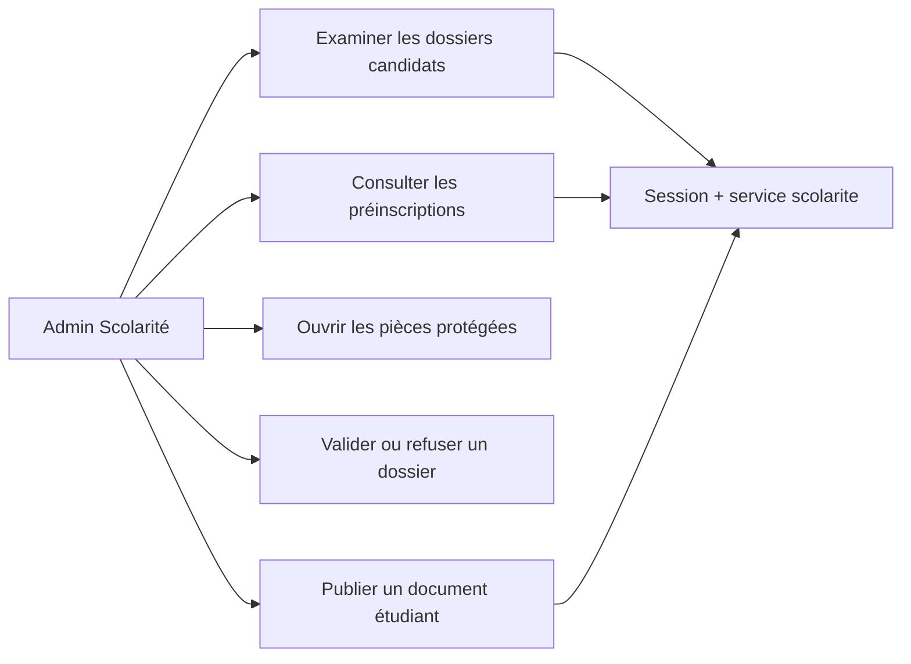
```mermaid
flowchart LR
    S[Admin Scolarité] --> Q[Examiner les dossiers candidats]
    S --> P[Consulter les préinscriptions]
    S --> D[Ouvrir les pièces protégées]
    S --> V[Valider ou refuser un dossier]
    S --> U[Publier un document étudiant]
    Q --> Auth[Session + service scolarite]
    P --> Auth
    U --> Auth
```

#### Fonctionnement

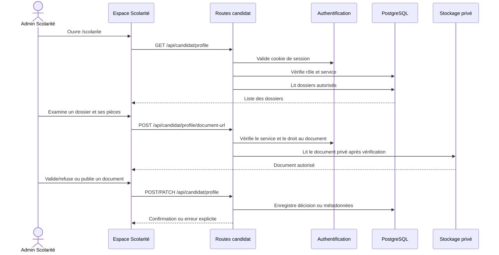
```mermaid
sequenceDiagram
    actor S as Admin Scolarité
    participant UI as Espace Scolarité
    participant API as Routes candidat
    participant Auth as Authentification
    participant DB as PostgreSQL
    participant FS as Stockage privé
    S->>UI: Ouvre /scolarite
    UI->>API: GET /api/candidat/profile
    API->>Auth: Valide cookie de session
    API->>DB: Vérifie rôle et service
    API->>DB: Lit dossiers autorisés
    DB-->>UI: Liste des dossiers
    S->>UI: Examine un dossier et ses pièces
    UI->>API: POST /api/candidat/profile/document-url
    API->>Auth: Vérifie le service et le droit au document
    API->>FS: Lit le document privé après vérification
    FS-->>UI: Document autorisé
    S->>UI: Valide/refuse ou publie un document
    UI->>API: POST/PATCH /api/candidat/profile
    API->>DB: Enregistre décision ou métadonnées
    API-->>UI: Confirmation ou erreur explicite
```

### 4.4 Admin Communication

#### Cas d'utilisation

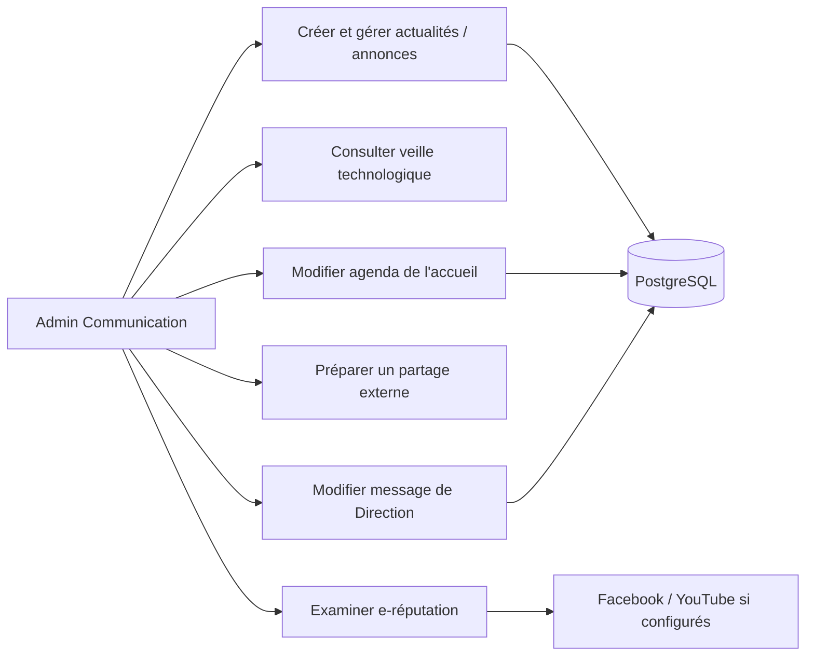
```mermaid
flowchart LR
    C[Admin Communication] --> N[Créer et gérer actualités / annonces]
    C --> V[Consulter veille technologique]
    C --> E[Examiner e-réputation]
    C --> P[Préparer un partage externe]
    C --> H[Modifier agenda de l'accueil]
    C --> M[Modifier message de Direction]
    N --> DB[(PostgreSQL)]
    H --> DB
    M --> DB
    E --> X[Facebook / YouTube si configurés]
```

#### Fonctionnement

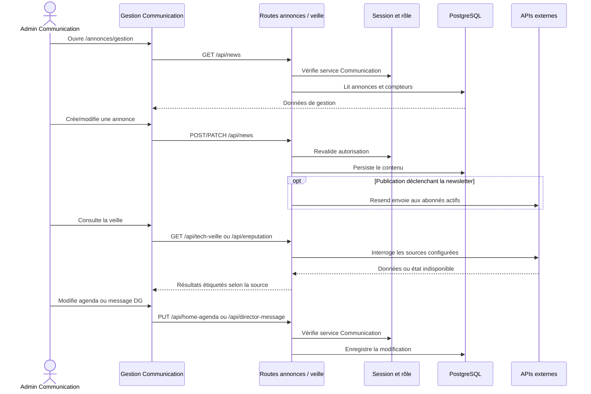
```mermaid
sequenceDiagram
    actor C as Admin Communication
    participant UI as Gestion Communication
    participant API as Routes annonces / veille
    participant Auth as Session et rôle
    participant DB as PostgreSQL
    participant Ext as APIs externes
    C->>UI: Ouvre /annonces/gestion
    UI->>API: GET /api/news
    API->>Auth: Vérifie service Communication
    API->>DB: Lit annonces et compteurs
    DB-->>UI: Données de gestion
    C->>UI: Crée/modifie une annonce
    UI->>API: POST/PATCH /api/news
    API->>Auth: Revalide autorisation
    API->>DB: Persiste le contenu
    opt Publication déclenchant la newsletter
      API->>Ext: Resend envoie aux abonnés actifs
    end
    C->>UI: Consulte la veille
    UI->>API: GET /api/tech-veille ou /api/ereputation
    API->>Ext: Interroge les sources configurées
    Ext-->>API: Données ou état indisponible
    API-->>UI: Résultats étiquetés selon la source
    C->>UI: Modifie agenda ou message DG
    UI->>API: PUT /api/home-agenda ou /api/director-message
    API->>Auth: Vérifie service Communication
    API->>DB: Enregistre la modification
```

### 4.5 Admin Direction des études

#### Cas d'utilisation

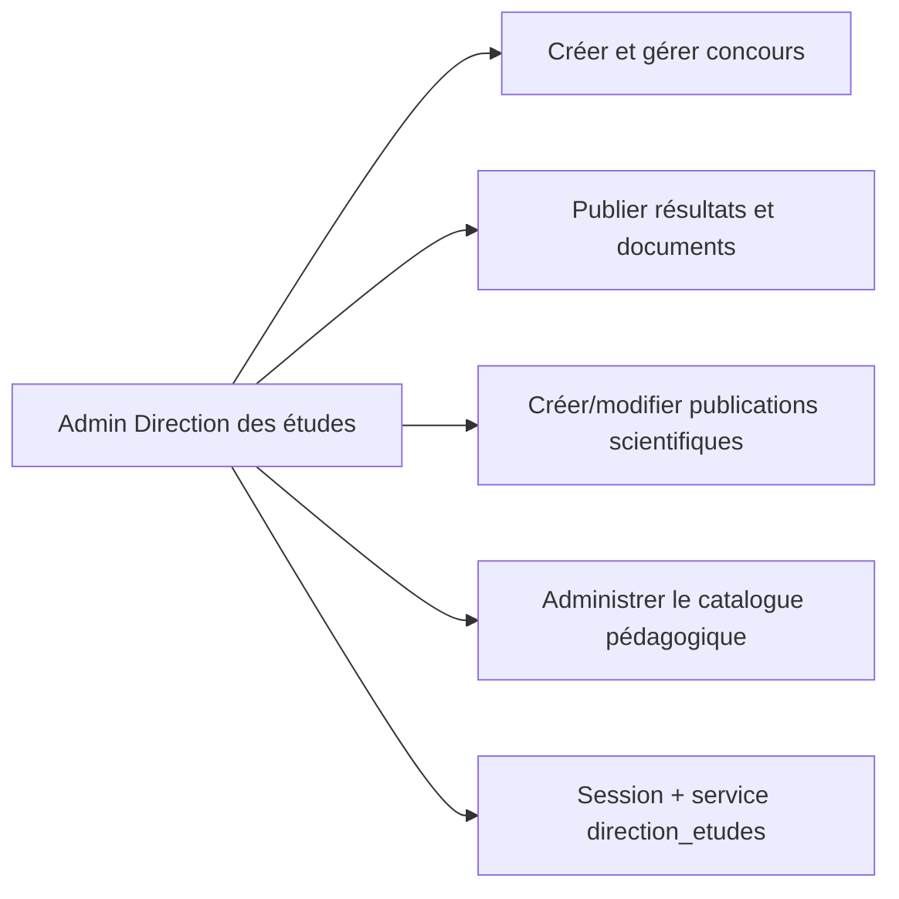
```mermaid
flowchart LR
    D[Admin Direction des études] --> C[Créer et gérer concours]
    D --> R[Publier résultats et documents]
    D --> P[Créer/modifier publications scientifiques]
    D --> F[Administrer le catalogue pédagogique]
    D --> Auth[Session + service direction_etudes]
```

#### Fonctionnement

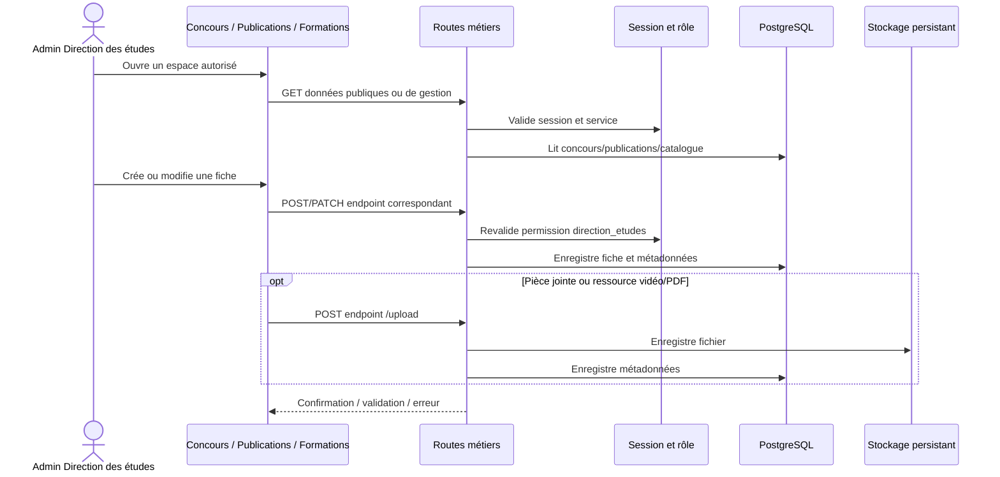
```mermaid
sequenceDiagram
    actor D as Admin Direction des études
    participant UI as Concours / Publications / Formations
    participant API as Routes métiers
    participant Auth as Session et rôle
    participant DB as PostgreSQL
    participant FS as Stockage persistant
    D->>UI: Ouvre un espace autorisé
    UI->>API: GET données publiques ou de gestion
    API->>Auth: Valide session et service
    API->>DB: Lit concours/publications/catalogue
    D->>UI: Crée ou modifie une fiche
    UI->>API: POST/PATCH endpoint correspondant
    API->>Auth: Revalide permission direction_etudes
    API->>DB: Enregistre fiche et métadonnées
    opt Pièce jointe ou ressource vidéo/PDF
      UI->>API: POST endpoint /upload
      API->>FS: Enregistre fichier
      API->>DB: Enregistre métadonnées
    end
    API-->>UI: Confirmation / validation / erreur
```

### 4.6 Admin RH

#### Cas d'utilisation

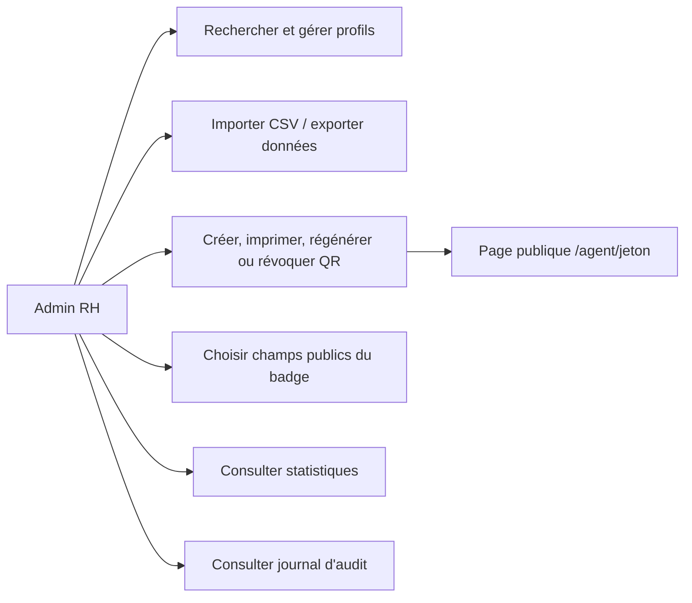
```mermaid
flowchart LR
    R[Admin RH] --> P[Rechercher et gérer profils]
    R --> I[Importer CSV / exporter données]
    R --> Q[Créer, imprimer, régénérer ou révoquer QR]
    R --> V[Choisir champs publics du badge]
    R --> S[Consulter statistiques]
    R --> A[Consulter journal d'audit]
    Q --> Agent[Page publique /agent/jeton]
```

#### Fonctionnement

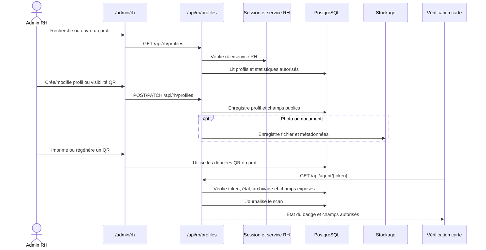
```mermaid
sequenceDiagram
    actor R as Admin RH
    participant UI as /admin/rh
    participant API as /api/rh/profiles
    participant Auth as Session et service RH
    participant DB as PostgreSQL
    participant FS as Stockage
    participant Public as Vérification carte
    R->>UI: Recherche ou ouvre un profil
    UI->>API: GET /api/rh/profiles
    API->>Auth: Vérifie rôle/service RH
    API->>DB: Lit profils et statistiques autorisés
    R->>UI: Crée/modifie profil ou visibilité QR
    UI->>API: POST/PATCH /api/rh/profiles
    API->>DB: Enregistre profil et champs publics
    opt Photo ou document
      API->>FS: Enregistre fichier et métadonnées
    end
    R->>UI: Imprime ou régénère un QR
    UI->>DB: Utilise les données QR du profil
    Public->>API: GET /api/agent/{token}
    API->>DB: Vérifie token, état, archivage et champs exposés
    API->>DB: Journalise le scan
    API-->>Public: État du badge et champs autorisés
```

### 4.7 Superadmin

#### Cas d'utilisation

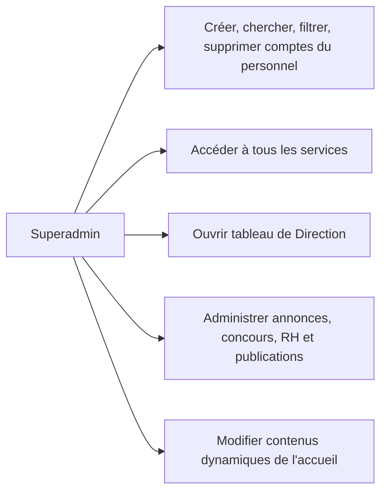
```mermaid
flowchart LR
    SA[Superadmin] --> U[Créer, chercher, filtrer, supprimer comptes du personnel]
    SA --> R[Accéder à tous les services]
    SA --> D[Ouvrir tableau de Direction]
    SA --> A[Administrer annonces, concours, RH et publications]
    SA --> H[Modifier contenus dynamiques de l'accueil]
```

#### Fonctionnement

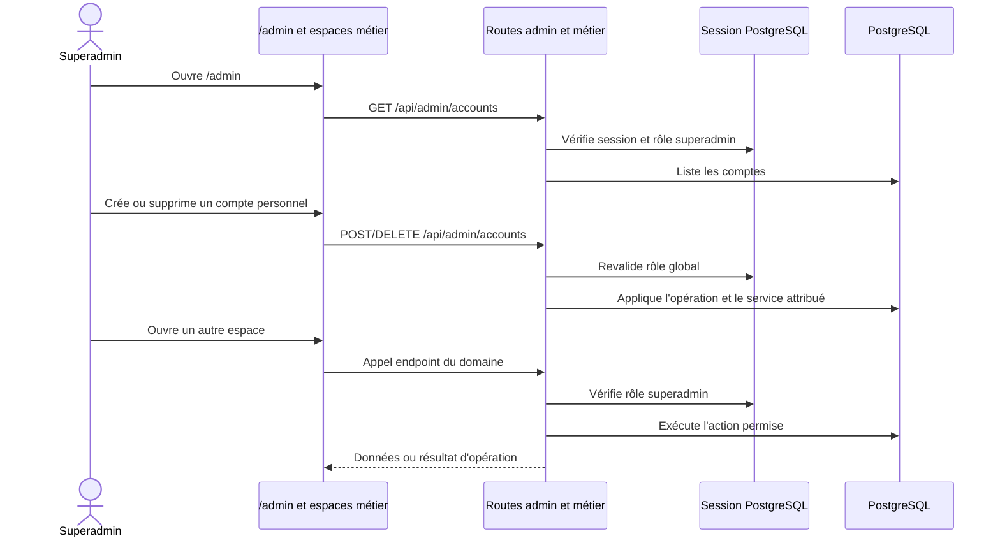
```mermaid
sequenceDiagram
    actor SA as Superadmin
    participant UI as /admin et espaces métier
    participant API as Routes admin et métier
    participant Auth as Session PostgreSQL
    participant DB as PostgreSQL
    SA->>UI: Ouvre /admin
    UI->>API: GET /api/admin/accounts
    API->>Auth: Vérifie session et rôle superadmin
    API->>DB: Liste les comptes
    SA->>UI: Crée ou supprime un compte personnel
    UI->>API: POST/DELETE /api/admin/accounts
    API->>Auth: Revalide rôle global
    API->>DB: Applique l'opération et le service attribué
    SA->>UI: Ouvre un autre espace
    UI->>API: Appel endpoint du domaine
    API->>Auth: Vérifie rôle superadmin
    API->>DB: Exécute l'action permise
    API-->>UI: Données ou résultat d'opération
```

### 4.8 Direction générale — interface dédiée

Le tableau `/directeur` n'est pas un rôle de service indépendant dans
l'interface de création actuelle : il s'agit d'une interface de direction
accessible au Superadmin.

#### Cas d'utilisation

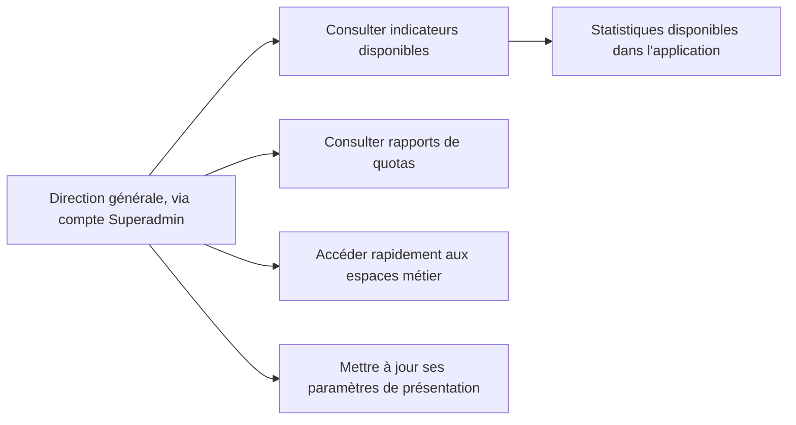
```mermaid
flowchart LR
    DG[Direction générale, via compte Superadmin] --> T[Consulter indicateurs disponibles]
    DG --> Q[Consulter rapports de quotas]
    DG --> A[Accéder rapidement aux espaces métier]
    DG --> P[Mettre à jour ses paramètres de présentation]
    T --> S[Statistiques disponibles dans l'application]
```

#### Fonctionnement

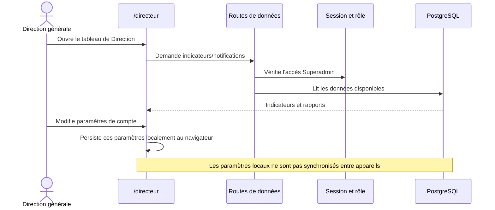
```mermaid
sequenceDiagram
    actor DG as Direction générale
    participant UI as /directeur
    participant API as Routes de données
    participant Auth as Session et rôle
    participant DB as PostgreSQL
    DG->>UI: Ouvre le tableau de Direction
    UI->>API: Demande indicateurs/notifications
    API->>Auth: Vérifie l'accès Superadmin
    API->>DB: Lit les données disponibles
    DB-->>UI: Indicateurs et rapports
    DG->>UI: Modifie paramètres de compte
    UI->>UI: Persiste ces paramètres localement au navigateur
    Note over UI,DB: Les paramètres locaux ne sont pas synchronisés entre appareils
```

## 5. Architecture complète

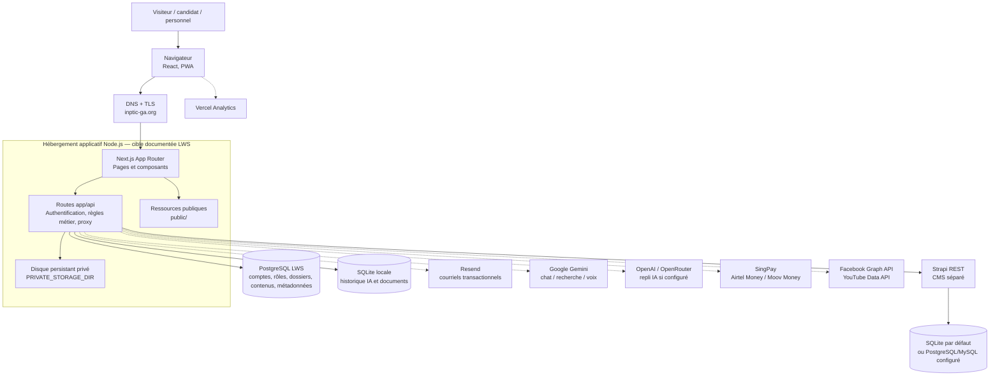
```mermaid
flowchart TB
    User["Visiteur / candidat / personnel"]
    Browser["Navigateur<br/>React, PWA"]
    DNS["DNS + TLS<br/>inptic-ga.org"]
    subgraph Host["Hébergement applicatif Node.js — cible documentée LWS"]
      Next["Next.js App Router<br/>Pages et composants"]
      API["Routes app/api<br/>Authentification, règles métier, proxy"]
      Static["Ressources publiques<br/>public/"]
      PrivateDisk["Disque persistant privé<br/>PRIVATE_STORAGE_DIR"]
    end
    PG[("PostgreSQL LWS<br/>comptes, rôles, dossiers, contenus, métadonnées")]
    ChatDB[("SQLite locale<br/>historique IA et documents")]
    Strapi["Strapi REST<br/>CMS séparé"]
    CMSDB[("SQLite par défaut<br/>ou PostgreSQL/MySQL configuré")]
    Mail["Resend<br/>courriels transactionnels"]
    Gemini["Google Gemini<br/>chat / recherche / voix"]
    Fallback["OpenAI / OpenRouter<br/>repli IA si configuré"]
    SingPay["SingPay<br/>Airtel Money / Moov Money"]
    Social["Facebook Graph API<br/>YouTube Data API"]
    Analytics["Vercel Analytics"]

    User --> Browser
    Browser --> DNS --> Next
    Next --> API
    Next --> Static
    API --> PG
    API --> ChatDB
    API --> PrivateDisk
    API --> Strapi --> CMSDB
    API -.-> Mail
    API -.-> Gemini
    API -.-> Fallback
    API -.-> SingPay
    API -.-> Social
    Browser -.-> Analytics
```

Les flèches pointillées indiquent des intégrations externes dépendantes de
secrets, comptes, permissions, réseau et disponibilité du fournisseur. Le
répertoire `chatbot/` est un ancien template distinct et n'est pas requis pour
faire fonctionner l'assistant du site. L'assistant intégré utilise tout de même
une base SQLite locale pour ses conversations et documents; prévoir un disque
persistant et un seul écrivain/processus compatible avec SQLite. Les handlers
actuels d'historique et de documents ne séparent pas les données par compte.
Strapi n'est pas la base centrale de l'authentification ni des profils/dossiers
candidats.

## 6. Schéma de fonctionnement général

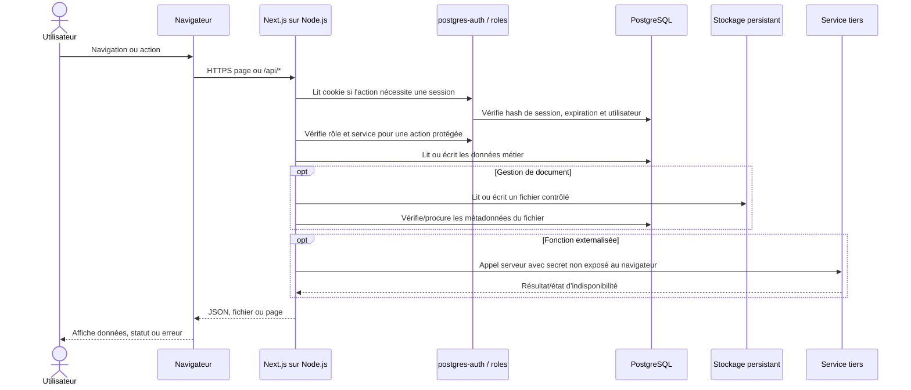
```mermaid
sequenceDiagram
    actor U as Utilisateur
    participant B as Navigateur
    participant N as Next.js sur Node.js
    participant Auth as postgres-auth / roles
    participant DB as PostgreSQL
    participant FS as Stockage persistant
    participant Ext as Service tiers
    U->>B: Navigation ou action
    B->>N: HTTPS page ou /api/*
    N->>Auth: Lit cookie si l'action nécessite une session
    Auth->>DB: Vérifie hash de session, expiration et utilisateur
    N->>Auth: Vérifie rôle et service pour une action protégée
    N->>DB: Lit ou écrit les données métier
    opt Gestion de document
      N->>FS: Lit ou écrit un fichier contrôlé
      N->>DB: Vérifie/procure les métadonnées du fichier
    end
    opt Fonction externalisée
      N->>Ext: Appel serveur avec secret non exposé au navigateur
      Ext-->>N: Résultat/état d'indisponibilité
    end
    N-->>B: JSON, fichier ou page
    B-->>U: Affiche données, statut ou erreur
```

## 7. Schéma des appels API

### 7.1 Parcours d'une requête

```mermaid
flowchart LR
    UI[Composant React] -->|fetch HTTPS same-origin| Route[Route app/api]
    Route --> Parse[Validation et normalisation entrée]
    Parse --> Session{Session requise ?}
    Session -->|Oui| Cookie[Cookie inptic_session]
    Cookie --> DBAuth[(PostgreSQL sessions + app_users)]
    DBAuth --> Perm{Rôle/service autorisé ?}
    Session -->|Non| Public[Route publique ou jeton individuel]
    Perm -->|Non| Deny[401 non connecté / 403 interdit]
    Perm -->|Oui| Logic[Logique métier serveur]
    Public --> Logic
    Logic --> DB[(PostgreSQL)]
    Logic --> Files[Disque / fichiers contrôlés]
    Logic -.-> Third[API tierce]
    DB --> Response[JSON / redirection / fichier]
    Files --> Response
    Third -.-> Response
    Response --> UI
```

### 7.2 Catalogue des routes applicatives

Les méthodes indiquées sont celles exportées par les handlers actuels.
Les permissions détaillées peuvent dépendre de la méthode et du paramètre;
`public/conditionnel` signifie qu'une lecture publique coexiste avec des
opérations réservées. Toujours vérifier le handler avant d'ajouter un client
ou de modifier un droit.

| Route | Méthodes | Domaine / accès principal |
| --- | --- | --- |
| `/api/auth/signup` | POST | Inscription candidat; courriel de vérification requis |
| `/api/auth/login` | POST | Connexion par identifiants |
| `/api/auth/session` | GET | Session courante |
| `/api/auth/logout` | POST | Révocation session |
| `/api/auth/oauth` | GET | Démarrer OAuth |
| `/api/auth/oauth/callback` | GET | Callback fournisseur OAuth |
| `/api/auth/verify-email` | GET | Vérifier jeton courriel |
| `/api/auth/password/forgot` | POST | Demande de réinitialisation |
| `/api/auth/password/reset` | POST | Réinitialisation avec jeton |
| `/api/auth/account/email` | POST | Modification e-mail authentifiée |
| `/api/auth/account/password` | POST | Modification mot de passe authentifiée |
| `/api/candidat/login` | POST | Route de compatibilité vers le login |
| `/api/candidat/profile` | GET, POST | Profil candidat; lecture personnelle ou accès Scolarité autorisé |
| `/api/candidat/profile/document-url` | GET, POST | Accès à un document candidat sous contrôle d'accès |
| `/api/concours` | GET, POST, PATCH, DELETE | Lecture publique et gestion staff autorisée |
| `/api/concours/preinscriptions` | GET, POST | Préinscription candidat; consultation staff autorisée |
| `/api/concours/upload` | POST, DELETE | Pièces concours réservées |
| `/api/payment/create` | POST | Création transaction SingPay |
| `/api/payment/status` | GET | Vérification transaction |
| `/api/news` | GET, POST, PATCH, DELETE | Lecture publique; gestion Communication/Superadmin |
| `/api/news/engagement` | GET, POST | Lire/enregistrer engagement d'articles |
| `/api/annonces/upload` | POST, DELETE | Fichiers de communication sous autorisation |
| `/api/tech-veille` | GET | Flux de veille technologique |
| `/api/ereputation` | GET, POST, PATCH | Sources et actions de veille; droits Communication |
| `/api/home-agenda` | GET, PUT | Lecture publique; modification Communication/Superadmin |
| `/api/director-message` | GET, PUT | Lecture publique; modification Communication/Superadmin |
| `/api/publications` | GET, POST, PATCH, DELETE | Lecture publique; gestion Direction des études/Superadmin |
| `/api/publications/upload` | POST, DELETE | Pièces jointes publications, accès contrôlé |
| `/api/formations` | GET | Lecture via le CMS Strapi |
| `/api/formations/catalogue` | GET, POST, PATCH, DELETE | Ressources du catalogue; gestion Direction des études |
| `/api/formations/catalogue/upload` | POST | Téléversement de ressources formations |
| `/api/search` | GET | Recherche de formations et actualités via Strapi |
| `/api/alumni` | GET, POST, PUT | Annuaire; écritures soumises à identité/propriété |
| `/api/rh/profiles` | GET, POST, PATCH | Profils et opérations RH; rôle/service RH requis |
| `/api/agent/{token}` | GET | Vérification publique de badge; QR et audit |
| `/api/admin/accounts` | GET, POST, DELETE | Gestion des comptes du personnel; Superadmin |
| `/api/admin/audit` | GET | Journal paginé et filtrable; Superadmin seulement |
| `/api/storage/{...segments}` | GET | Lecture de fichiers publics enregistrés |
| `/api/newsletter` | POST | Inscription newsletter; courriel de confirmation |
| `/api/newsletter/unsubscribe` | GET, POST | Présentation et confirmation du désabonnement |
| `/api/chat` | POST | Conversation IA et historique |
| `/api/chat/history` | GET | Historique SQLite; le handler actuel ne lie pas la lecture à un compte utilisateur |
| `/api/chat/documents` | GET, POST | Documents SQLite; le handler actuel ne lie pas la lecture/écriture à un compte utilisateur |
| `/api/chat/speech` | POST | Synthèse vocale Gemini si configurée |
| `/api/translate` | POST | Traduction par service IA configuré |

### 7.3 Échanges vers les services externes

```mermaid
sequenceDiagram
    participant API as Route serveur Next.js
    participant PG as PostgreSQL LWS
    participant CDB as SQLite chatbot
    participant Resend
    participant Google as Google OAuth / Gemini
    participant SingPay
    participant Meta as Facebook Graph API
    participant YouTube as YouTube Data API
    participant CMS as Strapi REST
    API->>PG: Requête SQL paramétrée
    API->>CDB: Lit/écrit l'historique et les documents du chatbot
    API->>Resend: Courriel confirmation, reset ou newsletter si configuré
    API->>Google: OAuth, chat, recherche ou synthèse vocale si configuré
    API->>SingPay: Créer et vérifier transaction si configuré
    API->>Meta: Lire veille/commentaires ou répondre Facebook si permissions
    API->>YouTube: Lire commentaires si clé autorisée
    API->>CMS: Lire formations/contenus encore hébergés dans Strapi
```

Les clés et secrets de ces services restent dans l'environnement serveur. Le
navigateur ne doit pas appeler directement les API avec des secrets.

### 7.4 Fonctionnement de l'API d'authentification Google

Le client lance la connexion en redirigeant le navigateur vers
`GET /api/auth/oauth?provider=google`. La route de démarrage crée un `state`
aléatoire et le conserve dans un cookie temporaire; le callback vérifie ce
`state` avant d'échanger le code. Le serveur récupère ensuite l'identité Google
et ne poursuit que si Google confirme l'adresse e-mail. Le secret OAuth n'est
utilisé que côté serveur.

```mermaid
sequenceDiagram
    actor U as Utilisateur
    participant B as Navigateur
    participant C as lib/auth-client.ts
    participant API as Routes Next.js OAuth
    participant G as Google OAuth / OpenID
    participant DB as PostgreSQL
    U->>B: Choisit « Continuer avec Google »
    B->>C: signInWithOAuth(provider=google)
    C->>API: GET /api/auth/oauth?provider=google
    API->>API: Génère state aléatoire
    API-->>B: Cookie inptic_oauth_state (HttpOnly, 10 min)<br/>et redirection vers Google
    B->>G: Demande d'autorisation (openid, email, profile)
    G-->>B: Redirection callback avec code et state
    B->>API: GET /api/auth/oauth/callback?code=...&state=...
    API->>API: Compare state au cookie (comparaison résistante au timing)
    alt State invalide, refus Google ou code manquant
        API-->>B: Redirection /candidat?authError=oauth-failed
    else State valide
        API->>G: POST échange code contre access_token
        G-->>API: access_token
        API->>G: GET userinfo avec le jeton
        G-->>API: E-mail, nom, photo, email_verified
        alt E-mail absent ou non vérifié
            API-->>B: Redirection vers /candidat avec erreur OAuth
        else E-mail vérifié
            API->>DB: UPSERT app_users par e-mail<br/>(nouveau compte : rôle etudiant)
            DB-->>API: Identifiant et rôle du compte
            API->>DB: Crée une session locale
            API-->>B: Cookie de session HttpOnly<br/>et redirection /candidat?oauth=success
        end
    end
```

Le cookie d'état est supprimé par le callback en succès comme en erreur. Un
compte déjà présent est rapproché par e-mail : le callback met à jour ses
métadonnées et confirme l'e-mail sans remplacer son rôle existant. Configurer
`GOOGLE_CLIENT_ID` et `GOOGLE_CLIENT_SECRET` côté serveur, puis déclarer dans
Google Cloud la même URI de retour que celle calculée depuis l'origine du site :
`https://inptic-ga.org/api/auth/oauth/callback` en production. Le détail de
l'implémentation se trouve dans
[`app/api/auth/oauth/route.ts`](./app/api/auth/oauth/route.ts),
[`app/api/auth/oauth/callback/route.ts`](./app/api/auth/oauth/callback/route.ts)
et [`lib/auth-client.ts`](./lib/auth-client.ts).

## 8. Modèle de données et stockage

Le schéma SQL de référence se trouve dans
[`scripts/00_lws_complete_schema.sql`](./scripts/00_lws_complete_schema.sql)
et les extensions/migrations dans [`scripts/`](./scripts/). Les principales
tables applicatives comprennent :

| Domaine | Tables principales | Contenu |
| --- | --- | --- |
| Identité | `app_users`, `app_sessions`, `password_reset_tokens`, `email_verification_tokens` | Comptes, sessions hachées, vérification e-mail et récupération |
| Candidatures | `profiles`, `concours`, `concours_preinscriptions` | Dossiers candidats, concours et préinscriptions |
| Documents | `private_files` + fichiers sur disque | Métadonnées, visibilité, propriétaire et contenu binaire |
| Publications | `actualites`, `actualites_engagement_counters`, `actualites_engagement_visitors`, `publications` | Actualités, interactions et travaux scientifiques |
| Accueil | `homepage_agenda`, `homepage_director_message` | Agenda et message publiés |
| Formations | `training_catalog` et contenus Strapi | Ressources vidéo/PDF et contenu de catalogue |
| RH | `rh_profiles`, `rh_audit_logs` | Profils du personnel, cartes, scans et événements d'audit RH |
| Traçabilité globale | `site_audit_logs` | Opérations API auditées, acteur et rôle/service/direction au moment de la requête, résultat et horodatage |
| Alumni | `alumni` | Profil Alumni et lien propriétaire vérifié |
| Newsletter | `subscribers`, `newsletter_deliveries` | Abonnements, jetons de désabonnement et suivi d'envoi |
| Assistant | SQLite `chats`, `messages`, `documents` | Conversations, messages et documents éditables du chatbot |

### 8.1 Fichiers

`PRIVATE_STORAGE_DIR` doit pointer vers un chemin persistant et accessible par
le processus Node.js. Les fonctions de stockage valident les segments de chemin
et associent les fichiers à des lignes dans `private_files`. Un fichier privé
n'est pas rendu public simplement parce qu'il existe sur disque. Sa route doit
vérifier la session, le propriétaire ou le droit métier avant de servir le
contenu. Les fichiers publics sont servis par `/api/storage/...` à partir de
métadonnées enregistrées.

### 8.2 Authentification

Les mots de passe sont hachés avec scrypt. Le jeton de session aléatoire n'est
pas stocké en clair en base : seul son hash est associé à l'utilisateur et à
son expiration. Le cookie `inptic_session` est `HttpOnly`, `SameSite=Lax`,
`Secure` en production et valable trente jours selon le code actuel. Logout
révoque la session en base et efface le cookie. Les routes métier obtiennent le
compte via `getAuthenticatedUser`, puis appliquent les helpers d'autorisation.

### 8.3 Journal global des actions

Les opérations d'écriture instrumentées et les parcours de connexion/vérification
écrivent dans `site_audit_logs` via `lib/site-audit.ts`. L'entrée conserve un
instantané de l'identité connue, du rôle, du service et de la direction, la route,
la méthode HTTP, le libellé de l'action, le code de réponse et les horodatages.
Les tentatives refusées sont également conservées; les événements non terminés
restent identifiés comme tels après une interruption. Les mots de passe, jetons
et corps des formulaires ne sont pas copiés dans le journal. L'API
`/api/admin/audit` est réservée au Superadmin et fournit recherche, filtres par
service/période et pagination.

Ce journal est une traçabilité des actions API instrumentées, pas un collecteur
de chaque clic ou de chaque lecture publique. Les accès aux documents candidats
sont aussi tracés via leur route de lecture; les scans RH disposent en plus de
leur journal RH dédié. Pour les actions non authentifiées, l'acteur est marqué
comme visiteur; le serveur ne peut pas garantir l'identité d'une personne sans
session. Les requêtes de traduction et de synthèse vocale sans persistance ne
sont pas considérées comme des opérations métier.

## 9. Hébergement et exploitation

### 9.1 Cible d'hébergement

- **Site Next.js** : processus Node.js sur l'hébergement LWS décrit dans le
  README; domaine public prévu `https://inptic-ga.org`.
- **PostgreSQL** : base distante LWS accessible depuis le serveur applicatif
  via `DATABASE_URL`.
- **Journal d'audit** : appliquer `scripts/17_create_site_audit_logs.sql` aux
  bases déjà installées avant de déployer les handlers instrumentés. Le schéma
  complet `scripts/00_lws_complete_schema.sql` et
  `scripts/13_lws_application_schema.sql` incluent aussi la table.
- **Stockage fichiers** : disque persistant du serveur via
  `PRIVATE_STORAGE_DIR`; ne pas utiliser un disque éphémère pour les fichiers
  candidats ou RH.
- **Téléversement catalogue** : PDF jusqu'à 50 Mio; MP4/WebM jusqu'à 15 Mio.
  Configurer également toute limite de taille de corps HTTP du reverse proxy ou
  de l'hébergeur au-dessus de 50 Mio (plus la marge multipart).
- **SQLite de l'assistant** : fichier local paramétrable par
  `INPTIC_CHATBOT_DB_PATH`; le runtime doit fournir `node:sqlite` (Node.js
  22.5+). Le champ `engines` du site annonce `>=20`, mais cela ne garantit pas
  le fonctionnement de ce sous-système sur toute version Node 20.
- **Strapi** : CMS distinct; son URL est configurée par
  `NEXT_PUBLIC_STRAPI_URL`, avec son jeton d'accès conservé côté serveur.
- **Services tiers** : Resend, Google, SingPay, Meta et YouTube sont des
  dépendances réseau distinctes, activées par configuration.

L'application Node.js et le CMS Strapi ont des commandes et processus
séparables. `npm run start:all` les lance ensemble pour les environnements où
cela est adapté; cela ne signifie pas qu'ils partagent le même cycle de vie en
production.

### 9.2 Variables d'environnement

Définir les variables dans le gestionnaire de secrets du déploiement, jamais
dans Git. Les valeurs sont volontairement omises.

| Variable | Usage |
| --- | --- |
| `DATABASE_URL` | Connexion PostgreSQL de l'application |
| `PRIVATE_STORAGE_DIR` | Répertoire persistant des fichiers |
| `INPTIC_CHATBOT_DB_PATH` | Chemin facultatif du fichier SQLite chatbot |
| `AUTH_SITE_URL` | Origine HTTPS officielle, normalement `https://inptic-ga.org` |
| `NEXT_PUBLIC_SITE_URL` | Origine publique utilisée par certaines URL serveur/contenus |
| `GOOGLE_CLIENT_ID`, `GOOGLE_CLIENT_SECRET` | OAuth Google |
| `RESEND_API_KEY`, `AUTH_FROM_EMAIL` | Courriels d'authentification |
| `NEWSLETTER_FROM_EMAIL`, `NEWSLETTER_SITE_URL` | Newsletter et URL publiques |
| `GEMINI_API_KEY` ou `GOOGLE_GENERATIVE_AI_API_KEY` | Assistant et synthèse vocale |
| `GEMINI_MODEL`, `GEMINI_TTS_MODEL` | Choix facultatifs de modèles |
| `OPENAI_API_KEY`, `OPENROUTER_API_KEY` | Fournisseurs IA de repli |
| `SINGPAY_GATEWAY_URL`, `SINGPAY_CLIENT_ID`, `SINGPAY_CLIENT_SECRET`, `SINGPAY_WALLET_ID`, `SINGPAY_DISBURSEMENT_ID` | Paiement SingPay |
| `FACEBOOK_PAGE_ID`, `FACEBOOK_PAGE_ACCESS_TOKEN`, `FACEBOOK_GRAPH_API_VERSION` | Veille/réponse Facebook si permissions accordées |
| `YOUTUBE_API_KEY` | Lecture de données YouTube |
| `NEXT_PUBLIC_STRAPI_URL`, `STRAPI_API_TOKEN` | API Strapi; jeton serveur seulement |

Toute variable préfixée `NEXT_PUBLIC_` est susceptible d'être incluse dans le
bundle client : aucun mot de passe, secret OAuth, clé API privée, URL PostgreSQL
avec identifiants ou token de service ne doit porter ce préfixe.

### 9.3 Commandes principales

| Commande | Utilité |
| --- | --- |
| `npm install` | Installer les dépendances du site |
| `npm run dev` | Lancer Next.js en développement |
| `npm run lint` | Vérifier TypeScript avec `tsc --noEmit` |
| `npm run build:next` | Générer les types, vérifier TypeScript et construire Next.js |
| `npm run start` | Lancer le serveur Next.js construit |
| `npm run dev:strapi` | Lancer Strapi en développement |
| `npm run build:strapi` | Installer puis construire Strapi |
| `npm run start:strapi` | Lancer Strapi en production |
| `npm run create-admin` | Créer un compte personnel depuis un terminal serveur sécurisé |

### 9.4 Mise en service indicative

1. Configurer DNS/TLS pour `inptic-ga.org` et vérifier la résolution et le
   certificat depuis l'extérieur.
2. Installer Node.js 22.5+ pour couvrir également l'import `node:sqlite` du
   chatbot (le manifeste du site annonce `>=20`) et les dépendances du site.
3. Créer la base PostgreSQL et définir les secrets serveur.
4. Exécuter le schéma initial et les migrations utiles dans l'ordre documenté
   par le README et les routes concernées.
5. Configurer et vérifier le chemin persistant `PRIVATE_STORAGE_DIR`, ses
   permissions système et les sauvegardes.
6. Configurer OAuth, les courriels et les URL de retour sur le domaine officiel.
7. Configurer Strapi et ses permissions si les pages de formation en dépendent.
8. N'activer SingPay et les intégrations de veille qu'après vérification des
   identifiants, autorisations et environnement de test/production.
9. Construire avec `npm run build:next`, démarrer le service, vérifier les
   journaux, puis valider les parcours de chaque rôle avec des comptes dédiés.
10. Sauvegarder PostgreSQL et les fichiers persistants; tester régulièrement la
    restauration, pas seulement la création de sauvegardes.

## 10. Sécurité opérationnelle et limites

- Ne jamais transmettre au navigateur les secrets de fournisseur ou la
  connexion PostgreSQL.
- Traiter `401` comme une absence de session et `403` comme un refus
  d'autorisation; ne pas masquer ces réponses par un succès de repli.
- Réserver les documents de candidatures et RH; contrôler l'accès dans chaque
  route de lecture et d'écriture.
- Le jeton d'une carte QR est un lien d'accès public : protéger sa diffusion,
  révoquer les cartes perdues et n'exposer que les champs autorisés.
- Les handlers actuels de `/api/chat/history` et `/api/chat/documents` ne
  montrent pas de contrôle de session ou de séparation des enregistrements par
  utilisateur. Ne pas les considérer comme un espace privé multi-comptes sans
  compléter cette politique d'accès.
- Un paiement n'est confirmé qu'après vérification d'état auprès de SingPay;
  une transaction en attente ne vaut pas quittance acquittée.
- Les liens de partage social ne prouvent pas la publication. L'envoi de
  réponses Facebook dépend d'une permission valide; les réponses YouTube et
  l'automatisation de publication ne sont pas garanties.
- Certains réglages de présentation du compte de Direction sont stockés dans
  le navigateur et ne sont donc pas synchronisés entre appareils.
- Les limites de taille/formats de téléversement sont définies dans les
  handlers et formulaires; appliquer les limites de proxy/hébergement en
  cohérence avec le code.
- Les dépendances externes peuvent être indisponibles même si leur clé est
  configurée. Contrôler leurs journaux et statuts avant de diagnostiquer un
  défaut comme une panne du site.

## 11. Contrôles de recette technique

- Parcourir les pages publiques sur ordinateur et téléphone et vérifier le
  domaine, TLS, navigation, changement de langue, thème et installation PWA.
- Vérifier recherche, contenu Strapi, agenda, message de Direction, newsletter
  et courriel de confirmation.
- Tester la création candidat, la vérification e-mail, l'ouverture/fermeture de
  session, la préinscription, le dépôt sécurisé, le suivi et le paiement.
- Vérifier chaque rôle : accès attendu, refus `401/403` hors service et absence
  de fuite de fichier en changeant l'identifiant ou le jeton.
- Tester gestion actualités, concours, publications, catalogue, RH, journal
  d'audit, QR public et propriété de fiche Alumni.
- Faire les tests de paiement dans l'environnement prévu; ne pas utiliser de
  transaction de production pour une recette.
- Vérifier la restauration d'une sauvegarde PostgreSQL et du répertoire de
  fichiers persistants.
- Vérifier depuis un Superadmin le journal global, les filtres et la pagination;
  confirmer qu'un Admin standard reçoit `403` et qu'un compte supprimé reste
  identifiable par son instantané d'audit.
- Consulter les journaux Node.js et les tableaux de bord des fournisseurs pour
  distinguer erreurs métier, erreurs de configuration et indisponibilités.
